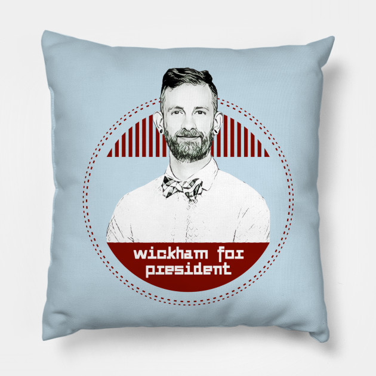
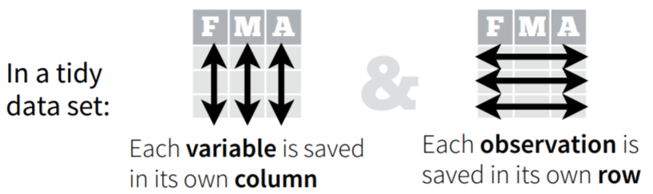

```{r setup, include=FALSE}
options(htmltools.dir.version = FALSE)
#options(crayon.enabled = TRUE)

```


layout: true
  
<div class="my-header"></div>

<div class="my-footer"><span>Cécile SAUDER    
&emsp;&emsp;&emsp;&emsp;&emsp;&emsp;&emsp;&emsp;&emsp;&emsp;&emsp;&emsp;&emsp;
&emsp;&emsp;&emsp;&emsp;&emsp;&emsp;&emsp;&emsp;&emsp;&emsp;&emsp;&emsp;
12/12/2018</span></div> 
---
background-image: url(https://github.com/rstudio/hex-stickers/raw/master/SVG/tidyverse.svg?sanitize=true)
background-size: 550px
background-position: 50% 50%


---
background-image: url(https://media.giphy.com/media/FHEjBpiqMwSuA/giphy.gif)
background-size: 400px
background-position: 85% 25%

# Tidy data

```{r echo=FALSE, out.width = "250px"}

```

--




---
background-image: url(https://github.com/rstudio/hex-stickers/raw/master/SVG/tidyverse.svg?sanitize=true)
background-size: 100px
background-position: 90% 3%

# [www.tidyverse.org](www.tidyverse.org)


```{r}

#install.packages("tidyverse")

library(tidyverse)

```
  
  
<br> 
  
```{r, echo=FALSE}

knitr::include_graphics("img/tidyband.png")
```


---

background-image: url('img/tidyverse.png')
background-size: 900px
background-position: 65% 45%


---

background-image: url('img/TMDB 5000 Movie Dataset _ Kaggle.png')
background-size: 800px
background-position: 50% 50%

# Data
---

background-image: url(https://github.com/rstudio/hex-stickers/raw/master/SVG/readr.svg?sanitize=true)
background-size: 100px
background-position: 90% 3%

# Import data 

```{r, message=FALSE, warning=FALSE, eval = FALSE}
data_movies <- read_csv("data/tmdb_5000_movies.csv")  #<<
data_credits <- read_csv("data/tmdb_5000_credits.csv") #<<

data_movies
```
---


background-image: url(https://github.com/rstudio/hex-stickers/raw/master/SVG/tibble.svg?sanitize=true)
background-size: 100px
background-position: 90% 3%

# Tibble

```{r, message=FALSE, warning=FALSE, highlight.output=c(1)}
data_movies <- read_csv("data/tmdb_5000_movies.csv") 
data_credits <- read_csv("data/tmdb_5000_credits.csv")

data_movies
```

---


background-image: url(https://github.com/rstudio/hex-stickers/raw/master/SVG/pipe.svg?sanitize=true)
background-size: 100px
background-position: 90% 3%

# Pipe data
--

.pull-left[

- old way : **verb(subject, complements)**  

```{r, eval=FALSE}
head(data_movies,3)
```

.center[ ]

]

--

- pipe way : **subject %>% verb(complements)**

```{r}
data_movies %>% head(3)
```

.center[]

---
background-image: url(https://github.com/rstudio/hex-stickers/raw/master/SVG/purrr.svg?sanitize=true)
background-size: 100px
background-position: 90% 3%

# Functional programming

```{r}
both <- list("data_movies" = data_movies, "data_credits" = data_credits)

both %>%
  map(names) #<<
```

---

background-image: url(https://github.com/rstudio/hex-stickers/raw/master/SVG/purrr.svg?sanitize=true)
background-size: 100px
background-position: 90% 3%

# Functional programming

```{r, highlight.output=c(3, 11)}
both <- list("data_movies" = data_movies, "data_credits" = data_credits)

both %>%
  map(names)
```

--
- => Rename **id** to **movie_id** + join both
---

background-image: url(https://media.giphy.com/media/l41YouCUUcreUabHW/giphy.gif)
background-size: 700px
background-position: 50% 50%


---

background-image: url(https://github.com/rstudio/hex-stickers/raw/master/SVG/dplyr.svg?sanitize=true)
background-size: 100px
background-position: 90% 3%

# Rename variables
```{r eval=FALSE, echo=TRUE}
both <- data_movies %>%
  rename(movie_id = id) %>% #<<
  left_join(data_credits)

```
---

background-image: url(https://github.com/rstudio/hex-stickers/raw/master/SVG/dplyr.svg?sanitize=true)
background-size: 100px
background-position: 90% 3%

# Join data
```{r }
both <- data_movies %>%
  rename(movie_id = id) %>% 
  left_join(data_credits) #<<
```
--

```{r}
both %>% names()
```

---


```{r echo=FALSE}
library(knitr)
library(kableExtra)

data_movies %>%
  head(10) %>%
  kable() %>%
  kable_styling(bootstrap_options = "striped", full_width = F) %>%
  scroll_box(width = "800px", height = "600px")
  

```
---

background-image: url(https://media.giphy.com/media/26gscNQHswYio5RBu/giphy.gif)
background-size: 700px
background-position: 50% 50%


---

background-image: url(https://github.com/rstudio/hex-stickers/raw/master/SVG/dplyr.svg?sanitize=true)
background-size: 100px
background-position: 90% 3%

# Select variables 
```{r}
data_movies <- data_movies %>%
  select(title, budget, vote_average, production_companies) #<<

```

```{r echo=FALSE}
data_movies %>%
  head(10) %>%
  kable() %>%
  kable_styling(bootstrap_options = "striped", full_width = F) %>%
  scroll_box(width = "800px", height = "400px")
``` 


---


background-image: url(https://github.com/rstudio/hex-stickers/raw/master/SVG/dplyr.svg?sanitize=true)
background-size: 100px
background-position: 90% 3%


# Add a column 


```{r, eval=FALSE}
data_movies <- data_movies %>%
  mutate(Production = case_when(  #<<
    str_detect(production_companies,"Disney") ~ "Disney",
    str_detect(production_companies,"Marvel") ~ "Marvel",
    str_detect(production_companies,"DC") ~ "DC",
    TRUE ~ "Other"
  )) 
```


---

background-image: url(https://github.com/rstudio/hex-stickers/raw/master/SVG/stringr.svg?sanitize=true)
background-size: 100px
background-position: 90% 3%


# String manipulation


```{r, eval=FALSE}
data_movies <- data_movies %>%
  mutate(Production = case_when(  
    str_detect(production_companies,"Disney") ~ "Disney", #<<
    str_detect(production_companies,"Marvel") ~ "Marvel", #<<
    str_detect(production_companies,"DC") ~ "DC",         #<<
    TRUE ~ "Other"
  )) 

```
---

background-image: url(https://github.com/rstudio/hex-stickers/raw/master/SVG/dplyr.svg?sanitize=true)
background-size: 100px
background-position: 90% 3%


# Remove a column


```{r}
data_movies <- data_movies %>%
  mutate(Production = case_when(  
    str_detect(production_companies,"Disney") ~ "Disney", 
    str_detect(production_companies,"Marvel") ~ "Marvel", 
    str_detect(production_companies,"DC") ~ "DC",         
    TRUE ~ "Other"
  )) %>%
  select(-production_companies) #<<

```


```{r echo=FALSE}
data_movies %>%
  head(10) %>%
  kable() %>%
  kable_styling(bootstrap_options = "striped", full_width = F) %>%
  scroll_box(width = "800px", height = "300px")
```
---

background-image: url(https://github.com/rstudio/hex-stickers/raw/master/SVG/dplyr.svg?sanitize=true)
background-size: 100px
background-position: 90% 3%

# Filter

Keep Disney, Marvel and DC movies


```{r}
data_movies2 <- data_movies %>%
  filter(Production != "Other") #<<

```
--
## group_by, summarise, arrange
```{r}
data_movies2 %>%
  group_by(Production) %>% #<<
  summarise(mean_vote = mean(vote_average)) %>% #<<
  arrange(desc(mean_vote))#<<
```

---

background-image: url(https://github.com/rstudio/hex-stickers/raw/master/SVG/ggplot2.svg?sanitize=true)
background-size: 100px
background-position: 90% 3%

# Visualize data 

```{r, message=FALSE, fig.width = 13, fig.height=6}

data_movies2 %>%
  ggplot(aes(x = budget, y = vote_average, 
             col = Production, label = title)) +
  geom_smooth() +
  facet_wrap(~Production) 
```

---

background-image: url(https://github.com/rstudio/hex-stickers/raw/master/SVG/ggplot2.svg?sanitize=true)
background-size: 100px
background-position: 90% 3%

# Visualize data 

```{r, message=FALSE,fig.width = 13, fig.height=6}
data_movies2 %>%
  ggplot(aes(x = budget, y = vote_average, 
             col = Production, label = title)) +
  geom_smooth() +
  facet_wrap(~Production) +
  geom_text(check_overlap = TRUE)
```


---


# Thanks!

- [Cheat sheets](https://www.rstudio.com/resources/cheatsheets/)


.center[]

Slides created via the R package [**xaringan**](https://github.com/yihui/xaringan) with the [**R-Ladies theme**](https://github.com/rladies/resources/blob/master/xaringan-slides/how_to_use.md) 

