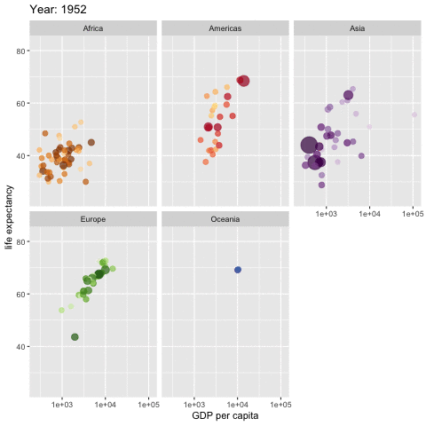

```{r setup, include=FALSE}
knitr::opts_chunk$set(echo = TRUE, results = 'hide')
options(htmltools.dir.version = FALSE)
#options(crayon.enabled = TRUE)
library(emo)

```


layout: true
  
<div class="my-header"></div>

<div class="my-footer"><span>Cécile SAUDER    
&emsp;&emsp;&emsp;&emsp;&emsp;&emsp;&emsp;&emsp;&emsp;&emsp;&emsp;&emsp;&emsp;
&emsp;&emsp;&emsp;&emsp;&emsp;&emsp;&emsp;&emsp;&emsp;&emsp;&emsp;&emsp;
12/02/2019</span></div> 
---
background-image: url(https://github.com/rstudio/hex-stickers/raw/master/SVG/tidyverse.svg?sanitize=true)
background-size: 550px
background-position: 50% 50%


---

background-image: url(https://github.com/rstudio/hex-stickers/raw/master/SVG/tidyverse.svg?sanitize=true)
background-size: 100px
background-position: 90% 3%

# [www.tidyverse.org](www.tidyverse.org)


```{r}

#install.packages("tidyverse")

library(tidyverse)

```
  
  
<br> 
  
```{r, echo=FALSE}


```


---


# Data

If you have your proper data you want to tidy, perfect, if not, I prepared you some exercises with the famous [**gapminder**](https://www.gapminder.org/videos/ted-us-state-department/) dataset.  
I was inspired by [David Robinson's course](https://www.datacamp.com/courses/introduction-to-the-tidyverse) on DataCamp.

1. Install and load the `tidyverse` `r emo::ji("package")` if it is not already done  
2. Install and load the `gapminder` `r emo::ji("package")`   
3. Look at the gapminder dataset

--

```{r, results='markup'}
#install.packages(gapminder)
library(gapminder)

gapminder
```

---


background-image: url(https://github.com/rstudio/hex-stickers/raw/master/SVG/pipe.svg?sanitize=true)
background-size: 100px
background-position: 90% 3%

# Pipe data

.pull-left[

- old way : **verb(subject, complements)**  

```{r}
head(gapminder,3)
```

.center[ ]

]

--

- pipe way : **subject %>% verb(complements)**

```{r}
gapminder %>% head(3)
```

.center[]


---


# Filter

1\. Filter the gapminder dataset for the year 2007
--

 - Hint: Don't forget to use `==` for a condition  

--
```{r}
gapminder %>%
  filter(year == 2007)
```
--
2\. Filter the gapminder dataset for China and the year 2002
--

 - Hint: and = `&`  

--
```{r}
gapminder %>%
  filter(country == "China" & year == 2002)
```
---


# Arrange

1\. Arrange the gapminder dataset by ascending population (`pop`)

--

```{r}
gapminder %>%
  arrange(pop)
```

--

2\. Arrange the gapminder dataset by descending population (`pop`)

--

 - Hint: `desc()`

--

```{r}
gapminder %>%
  arrange(desc(pop))
```

--

3\. Filter gapminder for `France` and arrange by descending life expectancy`lifeExp`

--

```{r}
gapminder %>%
  filter(country == "France") %>%
  arrange(desc(lifeExp))
```


---


# Mutate

1\. Create two new columns, one called `popMil` with the population in million
and the other called `lifeExpMonths` with the life expectancy in months

--

 - Hint1: `pop / 100000` , `lifeExp * 12`

--

 - Hint2: you can create as many columns as you want in the same `mutate()`
 
--
```{r}
gapminder %>%
  mutate(popMil = pop / 1000000,
         lifeExpMonths = lifeExp * 12)
```

---


# Mutate 


2\. Create a new colum `popUnderMillion` with 2 groups, one with `TRUE` when population `pop`is inferior to one million, and `FALSE` when  population is 
superior or equal to one million

--

 - Hint: use `if_else()`

--
```{r}
gapminder %>%
  mutate(
    popUnderMillion = if_else(
      pop < 1000000, 
      TRUE, 
      FALSE
    )
  )
```

---


# Mutate 


3\. Create a new column `lifeExpGroup` with three groups, `young` for `lifeExp`
is inferior to 50, `middle` when `lifeExp` is between 50 and 70, and `old` when it's superior to 70.

--

 - Hint: for more than to cases, use `case_when()`

--

```{r}
gapminder %>%
  mutate(
    lifeExpGroup = case_when(
      lifeExp < 50 ~ "young",
      lifeExp >= 50 & lifeExp <= 70 ~ "middle",
      lifeExp > 70 ~ "old",
      TRUE ~ NA_character_
    )
  )

```

---


# Select

1\. Select the continents `continent` and the countries `country`

--

 - Hint: You can use `starts_with("c")` (but it's not the only solution)

--

```{r}
gapminder %>%
  select(starts_with("c"))
```

or

```{r}
gapminder %>%
  select(continent, country)
```

--

2\. Select all variables except life expectancy `lifeExp`

--

```{r}
gapminder %>%
  select(-lifeExp)
```

---


# Select

3\. Select all the numerical variables

--

 - Hint: You can use `select_if()`

--

```{r}
gapminder %>%
  select_if(is.numeric)
```
---


# Summarise and group_by

1\. Find the mean `avg_lifeExp`, the standard deviation `sd_lifeExp` and the number of values `n_values` of `lifeExp` by `continent`, then arrange the results by descending `avg_lifeExp`.

--

```{r}
gapminder %>%
  group_by(continent) %>%
  summarise(
    avg_lifeExp = mean(lifeExp),
    sd_lifeExp = sd(lifeExp),
    n_values = n()
    ) %>%
  arrange(desc(avg_lifeExp))
```

---


# Summarise and group_by

2\. Find the mean of all the numerical variables

--

```{r}
gapminder %>%
  group_by(continent) %>%
  summarise(
    avg_lifeExp = mean(lifeExp),
    sd_lifeExp = sd(lifeExp),
    n_values = n()
    ) %>%
  arrange(desc(avg_lifeExp))
```


---


# ggplot

Now we have seen the basics of **Tidyverse**, let's continue with **ggplot2**. 

Sometimes you know what plot you want, but sometimes you don't. 
In that case we can take a look at the webpage [**R Graph Gallery**](https://www.r-graph-gallery.com/), or at [**ggplot2 extensions**](https://www.ggplot2-exts.org/gallery/), or, if, like me, you love interactive plots, the [**plotly**](https://plot.ly/r/) `r emo::ji("package")` is very cool.


---


#ggplot geom_boxplot

1\. Make boxplots of `lifeExp` by `continent`

--

```{r, eval = FALSE}
gapminder %>%
  ggplot(aes(x = continent, y = lifeExp)) +
  geom_boxplot()
```

--

2\. Customize your plot 
  - Reorder the boxplots with `forcats::fct_reorder`
  - Color the boxplots with the `aes fill`
  - Change the label axis with `labs()`
  - `coord_flip` your plot
  - Remove the legend

  
--

```{r, eval = FALSE}
p <- gapminder %>%
  ggplot(aes(x = forcats::fct_reorder(continent, -lifeExp), 
             y = lifeExp, 
             fill = continent)) +
  geom_boxplot() +
  labs(x = "", y = "Life Expectancy") +
  coord_flip() +
  theme(legend.position = 'none')
```

---


#ggplot geom_boxplot + plotly

```{r,  message = FALSE, eval=FALSE}
library(plotly)
ggplotly(p)
```

```{r, eval=FALSE, echo = FALSE}
pg <- ggplotly(p)
htmltools::save_html(pg, file="ggplotly.html")
```

<iframe src="ggplotly.html" width="800" height="500" scrolling="yes" seamless="seamless" frameBorder="0"> </iframe>


---


#ggplot geom_point

1\. Try to reproduce this plot 

```{r, echo=FALSE, fig.height= 6, fig.width= 9}
gapminder %>%
  filter(year == 2002) %>%
  ggplot(aes(gdpPercap, lifeExp, size = pop, colour = country)) +
    geom_point(alpha = 0.7) +
    scale_colour_manual(values = country_colors) +
    scale_size(range = c(2, 12)) +
    scale_x_log10() +
    facet_wrap(~continent) +
    theme(legend.position = 'none') +
    labs(title = 'Year: 2002', x = 'GDP per capita', y = 'Life Expectancy')
```

---


#ggplot

Hints : 

1\. Use the aes `size` and `color`

--

2\. Add `geom_point` with a transparancy parameter `alpha`

--

3\. Change x scale in log scale with `scale_x_log10`

--

4\. Adjust colors with `scale_colour_manual` and `country_colors`

--

5\. Adjust size points with `scale_size`

--

6\. Use `facet_wrap` to plot the continents separatly 

---


#ggplot

Here is the complete code for the plot : 

```{r, eval=FALSE}
gapminder %>%
  filter(year == 2002) %>%
  ggplot(aes(gdpPercap, lifeExp, size = pop, colour = country)) +
    geom_point(alpha = 0.7) +
    scale_colour_manual(values = country_colors) +
    scale_size(range = c(2, 12)) +
    scale_x_log10() +
    facet_wrap(~continent) +
    theme(legend.position = 'none') +
    labs(title = 'Year: 2002', x = 'GDP per capita', y = 'Life Expectancy')
```

---


#gganimate your ggplot

Now let's animate this ggplot by year. 

It's the example of the [**gganimate**](https://github.com/thomasp85/gganimate/wiki/Gapminder) `r emo::ji("package")` by [Thomas Lin Pedersen](https://twitter.com/thomasp85). 

It's very easy to animate your previous plot with **gganimate**:

1\. Load the [**gganimate**](https://github.com/thomasp85/gganimate/wiki/Gapminder) `r emo::ji("package")`

2\. Copy the code of your previous plot

3\. Change `title = 'Year: 2002'` to `title = 'Year: {frame_time}'` 

4\. Then add `+  transition_time(year)` 

---


#And TADAAAAAA

.center[ ]

---


# Thanks!

- [**Cheat sheets**](https://www.rstudio.com/resources/cheatsheets/)  
- [**R Graph Gallery**](https://www.r-graph-gallery.com/) by [Yan Holtz](https://twitter.com/R_Graph_Gallery)
- [**ggplot2 extensions**](https://www.ggplot2-exts.org/gallery/) by [Daniel Emaasit](https://twitter.com/emaasit)


.center[]

Slides created via the R package [**xaringan**](https://github.com/yihui/xaringan) with the [**R-Ladies theme**](https://github.com/rladies/resources/blob/master/xaringan-slides/how_to_use.md) 

